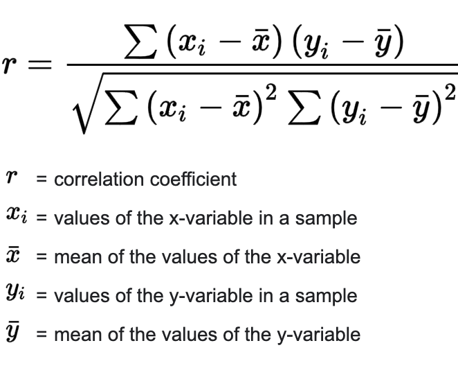

# Exploring Factors That Affect The Financing Of College Sports

## Introduction
- To explore the question of what factors effect the financing of college sports, I decided to look into some key elements that are unique to every university, including tuition, athletic conferences, and endowments. This topic is particularly interesting to me as it combines two of my main interests in life, which are athletics and statstics. I have played sports since I was young and playing college sports has always been a dream of mine. As it is coming true next year, it is becoming more important to me to learn about athletics programs at univisities, especially state schools that don't appear to have as much money as private universities, yet somehow generate massive atheltic departments. 

## Questions I am answering
1. Does a school’s tuition directly correlate to how much money they pour into their athletic programs? 
2. What conferences have the highest average support, and what conferences have the lowest? Does this follow my prediction that leagues with better ranked teams will have more money?
3. How largely do endowments contribute to the money given to the athletic programs of a university? 

## Theories/Predictions
1. For my first question surronding the correlation between the instate tuition of a school and the funding of their athletic departments, I predicted that these two pieces of data would be unrelated. As a result, it will have a semi-low correlation coefficient, as I do not think tuition would be a big factor in determining the funding a school's athletics. My logic behind this is that the majority of these schools are state funded and so tuition from students would not signficantly impact the money given to athletics. 
2. For my second question about if the conferences a team is a part of will impact the amount of money the athletic departments will recieve on average, I predict that it will affect it. I predict that conferences with better ranking teams will, on average, give more funding to their athletic departments, because these athletics will make the school itself more money as their games will tend to have better ticket sales. This can be seen by comparing a conference like the Southeastern Conference, which contains teams like Alabama and Auburn, to the Sunbelt conference, which contains teams like Arkansas State and Costal Carolina. I am predicting that the Southereastern Conference will have a higher average support than the Sunbelt conference for example as Alambama and Auburn tend to have teams with higher rankings than Arkansas State and Costal Carolina, and subsequently more people will want to watch their games. If more people watch the games, the school will make more money from them, and as a result will pour more money into their athletic department. 
3. For my third question about if endowments will contribute to the money given to the athletics of a school, I predict that it will have an impact. I predicted that endowments and funding would be closley correlated because I think that if a school has a greater endowment, they will have more money available to pour into their athletics.   

## Dataset Source
The data contained within this set includes the revenues/expenditures of over 234 Division I public universities. It attempts to explain the ways in which these schools pay for their large athletics programs, by showing the breakdown of finances of each school. The dataset comes from the collaboration between The Huffington Post and The Chronicle of Higher Education, which has covered the crossroads between college sports and academia for many years. I have permission to use this dataset from the owner because in the article that was written preceding the data, the author wrote that he encourages everyone to look at the data in order to tell their own stories about college sports subsidies, and the things that colleges give up to further their athletic programs.  

## Methods
I used three main methods in order to answer my three preliminary questions, each method directly correspodning to a question. As well, I used various helper methods in my program in order to make my code more general and conscice. 
1. To investigate how a school’s tuition affects the money given to their athletic programs, I created a function to look at both the instate tuition (as all schools on the list are state-schools) and the money given to the athletic programs and generate a correlation coefficient to determine how closely linked these two pieces of data are. This can be seen by the method: `public static void schoolTuitionComparedToAthletics(File dataset)` Within this function, I generated a list of the schools' instate tuition and compared it to a list of the the funding of the schools athletics programs, which I was able to obtain using the dataset. Then, using these two lists, I used a helper method I created to generate the correlation coefficient, using this formula:  This allowed me to determine overall how closely correlated tuition and funding are. 
2. To investigate how a conference affects the money given to the athletics programs, I created a method to find the average funding of a university's athletic departments for each specific conference. This can be seen by the method: `public static void conferenceRelationToSupport(File dataset)` Witin this method, I first created an arraylist of strings to represent the conferences, and then created an arraylist of arraylists to determine the total support of each school, within each conference.  In order to do this, I determined which conferecence each school is a part of, and the athletic funding each school is given. I then created a list of averages, each index representing the average total support of each conference. I was able to generate this list by taking the average of each sub-arraylist within the more complex totalSupport arraylist. I then printed out th list of averages, looked over it, and compared the numbers to one another. With this, I am able to manually look at each conference's average funding and determine if there is really a correlation between the rankings of the schools that a conference encompasses and the average funding of those conferences as I suspected. 
3. To investigate how endowments affect the money given to athletic teams, I did a very similar thing as I did to determine the correlation between tuition and funding. This can be seen by the method: `public static void schoolEndowmentsComparedToAthletics(File dataset)` Within this function, I generated a list of the schools' endowments and compared it to a list of the the funding of the schools athletic programs, which I was able to obtain using the dataset. Then, using these two lists, I used a helper method I created to generate the correlation coefficient, which allowed me to determine overall how closely correlated endowments and funding are.
- Finally, I created two helper methods: `public static double calcCorrelationCoeff(ArrayList<Double> x, ArrayList<Double> y)`, ` public static double mean(ArrayList<Double> list)` In first helper method listed, I  generated the correlation coefficient as I needed that number in multiple places in my code (which can be seen by the equation shown above). In the second method listed, I generated the mean of a given list. I made these two helper methods to make these two mathematical equations/steps reusable as I was able to call the methods in various places in my code (specifically to answer questions 1 and 3). 

## Process
The process that I went through to complete this entire project can be seen by the following steps. 
1. The first thing I needed to do to start my research was choose a dataset. I went about this by first looking through a spreadsheet of thousands of datasets and narrowing my search down to 2. Then when I began to investigate and read through each dataset, I decided the one about the financing of college sports would be more interesting to me as I feel a greater connection to it. 
2. Once I choose my specific dataset, I created preliminary research questions that I would then be able to edit in order to create my final questions that I would use both my dataset and a program I created to answer. 
3. Once I created these questions, I spent a day or two looking through my data, familiarizing myself with it, and determining what pieces of data I would be able to use to answer my research questions. I also made sure to look through the article that my dataset was a part of, in order to ensure I had permission to use it. 
4. Once I was familiar with the dataset, I had to convert my xcel spreadsheet into a .csv and move this file into the same folder that I was going to be coding my program in, in order to make it easily accessible to my code. 
5. After I created a new .java file and move my dataset into the same folder, I began coding and spent many days figuring out the correct methods to answer my research questions. 
6. Once I spent days writing and debuging my code, it finally generated the data I needed. I then collected this data and wrote about my results, and this concluded my research. 

## Challenges/Setbacks
Throughout this project, I faced a many minor setbacks, however I also faced one major setback. The biggest setback I faced was determining a way to take the data I generated for instate tuition and comparing it to the data of funding per school and determine a relationship. I was able to come up with both a list of the tuition of each school and a list of the funding of each school, however, with so many schools, I needed to find a way to generate a singular number, or at least fewer numbers to look at. In order to overcome this, I was able to use the correlation coefficient. This equation indicates how closely correlated datapoints are, and subsequently I was able to use it to not only determine the relationship between tutition and funding, but also endowments and funding (in the exact same way).  

## Results
The code I used to investigate my three preliminary questions proved very helpful. 
1. My first question, which was "Does a school’s tuition directly correlate to how much money they pour into their athletics programs?" was able to be answered by  the method I create to sift through this portion of my dataset. I generated a correlation coefficent to determine how closely correlated instate tuition and the funding of athletic programs are. My results proved my predictions to be true. I generated a correlation coefficient of 0.10867274009072829, which indicates that tuition and funding are uncorrelated. This shows that as funding of a school increases, the tuition has a tendency to slightly increase as well (however by extremley small margins). This proved my prediction correct as I did not think that a tuiton would much impact the funding of an athletic program at a school, especially ones that are funded by the state. 
2. My second question, which is "What conferences have the highest average support, and what conferences have the lowest? Does this follow my prediction that leagues with better ranked teams will have more money?" was also able to be answered using the method I created. I learned that my prediction was in fact incorrect, as some of the conferences with the highest averages, had schools with low rankings in many sports. Through my calculations, it can be seen that the three conferences with the highest average fundings are Conference USA, Mid-American Conference, and the Summit League. The Conference USA includes schools such as UNC (which is highly ranked in many sports), Alabama University at Birmingham, and Rice University. Mid-American Conference includes schools such as the Univserity of Miami, Ohio University, and Northern Illinois University. Finally, the Summit League includes schools such as North Dakota University, Kansas City University, and Western Illinois University. In contrast, the conferences with the three lowest average fundings were the Big-12 Conference, the Big South Conference, and schools which are Independent of a conference. The Big-12 Conference includes schools such as Oklamhoma State, Baylor, and Texas Tech. The Big South Conference includes schools such as High-Point Univeristy, Long Wood Univserity, and Charleston Southern University. Finally, the Independent schools include West Point, Notre Dame, and BYU. In name and ranking, the majoirity of the schools with higher fundings are lower down, and in contrast many of the schools in the conferences with lower average fundings have higher rankings. I believe this alludes to the point that the average funding of the athletics at schools in each conference is independent of ranking or status.
3. My third question, which was "How largely do endowments contribute to the money given to the athletics of a school? " was also answered by the program I created. By using the correlation coefficient, similar to what I did for comparing tuition to funding, I was able to compare the total endowments of a school to total funding given to a school's athletic department. This proved my prediction to be false because my correlation coefficient came out to be -0.17909342534423753, which indicated that endowments and funding of athletics are in fact not closely correlated. If a schools endowments increased, the funding of their athletics deapartments actually have a trend of decreasing slightly. However, because the correlation coefficient is very minor at only -.1 and not -.8 or -.9, it shows that these two factors are essentially not correlated, as if the coefficient was -.9 they would be almost perfectly negativley correlated (this means that as one increases, the other would almost proportionally decrease). This proved my prediction to be incorrect as I believed that schools with higher endowments would also have better funding for their atheltic departments. The reason that this could be false could be because these schools are funded by their states, so the endowments they have may not go towards athletics, and instead may go towards furthering their research or academics.

## Limitations
Despite the questions I was able to attempt to answer, there were many limitations to my research. The first and main limitation is the singular dataset I was able to use. Although extensive, it did not include out of state tuition for each school, which may have impacted the correlation coefficient between tutition and funding. As well, it did not have a breakdown of specific sports, which may have allowed me to narrow down my research question to center around particular sports. Finally, exlcuding the dataset, I think one of my biggest limitations with this project is my lack of knowledge of statstics. Because I have never taken a stats class, doing a project that centers around using a dataset to answer research questions, proved very difficult at points. This can be seen through my use of the correlation coefficient. Because I had never taken a stats class, I was not aware I would be able to determine how closely related two sets of numbers were by using a formula. Although I was able to overcome this challenge, it is a good example of how impactful statstics can be when gathering data to answer research questions. 

## Further things I could investigate
If I had more time, there are countless other things I could investigate when it comes to the financing of college athletics. One thing I would want to look into is if rankings of big sports teams, including football, basketball, and baseball, impact the amount of money athletic departments get. As well, I think it would be very interesting to see the breakdown of funding per sport at each school, rather than just for the athletics overall. Finally, I think it would be very interesting to look at the money that is put into athletics at universities in the United States in comparison to aborad, as I predict that US would have a signficantly higher funding for sports as athletics are given a big emphasis in America, unlike other parts of the world.